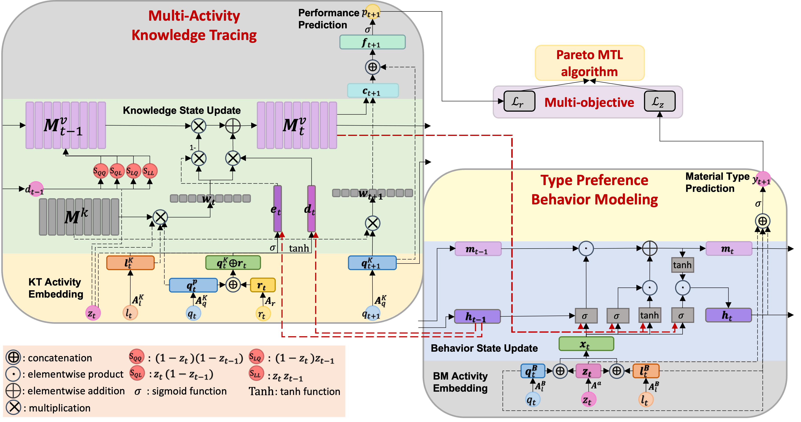

# Multi-Task Modeling of Student Knowledge and Behavior (KTBM)
Code for our paper:

 S. Zhao, and S. Sahebi. Multi-Task Modeling of Student Knowledge and Behavior. In Proceedings of the 33rd ACM International Conference on Information and Knowledge Management (CIKM ’24).

If you have any questions, please email szhao2@albany.edu

## KTBM Network Architecture:




## Prerequisit
```angular2html
numpy
torch
scipy
sklearn
pickle
more_itertools
easydict
matplotlib
```

### How to install and run

```angular2html
git clone https://github.com/persai-lab/2024-CIKM-KTBM
cd 2024-CIKM-KTBM
conda env create -f environment.yml
source init_env.sh
python run.py
```


## Cite:

Please cite our paper if you use this code in your own work:

```
@inproceedings{zhao2024Multitask,
  title={Multi-Task Modeling of Student Knowledge and Behavior},
  author={Zhao, Siqian and Sahebi, Sherry},
  booktitle={Proceedings of the 33rd ACM International Conference on Information and Knowledge Management (CIKM ’24)},
  pages={},
  year={2024}
}
```

## Collarators:
```angular2html
Siqian Zhao: szhao2@albany.edu
Sherry Sahebi: ssahebi@albany.edu
```

## Acknowledgement:

This paper is based upon work supported by the National Science Foundation under Grant No. 2047500.